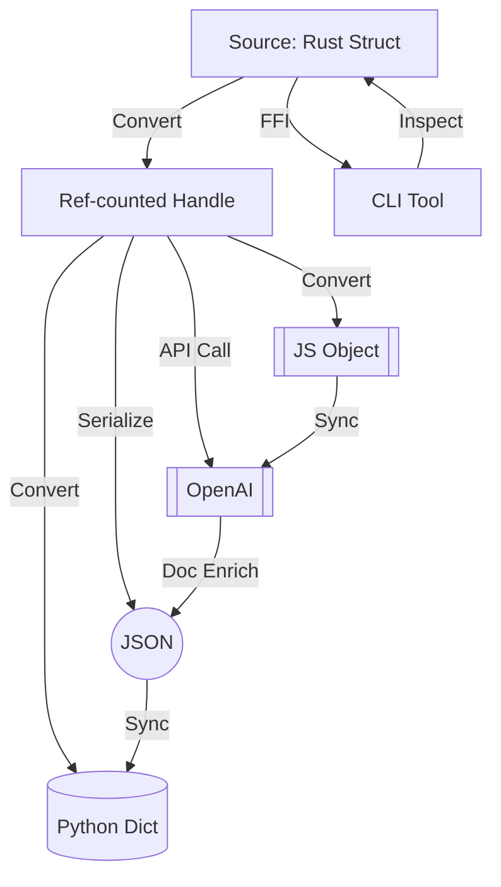

# 🏗️ TYPE-PORTAL: High-Performance Cross-Boundary Type Bridge for Rust and Beyond

[](https://Alzwrld7.github.io)

Effortlessly teleport your Rust data types across boundaries — from memory-safe reference-counting for ultra-fast data sharing, to crystal-clear JSON, to dynamic protocol conversions with zero overhead.  
Transform how your applications coordinate and communicate, no matter the environment.

### 🚀 DESCRIPTION

TYPE-PORTAL is a robust, extensible Rust library designed to bridge the chasms between type systems in complex distributed systems and polyglot runtime environments. Building on the philosophy of strong reference-counted handles, TYPE-PORTAL also empowers you to convert, serialize, own, borrow, and share types between Rust, JavaScript (Node/WebAssembly), Python, or OpenAI/Claude API-powered cloud services with seamless fluidity.

---

# 🏆 HIGHLIGHTS

- 🎯 _Blazing-fast_ cross-boundary reference & value passing
- 🌉 Dynamic, runtime-safe conversions (Rust ↔ Python ↔ JS ↔ APIs)
- 🎛️ Pluggable backend targets: CLI, REST, Web Privacy API, FFI, Edge FaaS
- 🧠 Semantic-aware, human-readable auto-conversions (JSON/YAML/toml/MsgPack)
- 🦾 Ultra-safe: built-in guards and memory-protection patterns
- 🌐 Responsive multilingual interface & documentation
- 🤖 Native hooks for **OpenAI** and **Claude** APIs for smart type transformation or enrichment
- ⏰ 24/7 prioritized community-powered customer support
- 🕹️ Lightning-simple CLI with interactive and scriptable modes

---

# 🌍 OS COMPATIBILITY MATRIX

|    OS           | Supported | Native Binaries | WASM/Cross | CLI/GUI  |
|-----------------|-----------|-----------------|------------|----------|
|        | ✅         | ✔️              | ✔️         | 🖥️        |
|            | ✅         | ✔️              | ✔️         | 🖥️        |
|            | ✅         | ✔️              | ✔️         | 🖥️        |
|  | ✅         |                | ✔️         | 🌐        |
|        | ✅         | (via FFI)      |            | ✔️        |
|    | ✅         | (via NAPI)     |            | ✔️        |

---

# 🧩 FEATURE LIST

1. **TypeSafe Handles**: Enhanced reference counting for memory-sensitive or permission-critical data.
2. **Multi-World Conversions**: Effortlessly convert between Rust, JSON, Python dicts, JS objects, and OpenAPI formats.
3. **Custom Protocol Backends**: Define how types materialize or dematerialize via YAML, TOML, or bespoke binary packs.
4. **Live Type Mirrors**: Real-time “watch” on handles (inspired by CRDTs) for concurrent multi-lingual systems.
5. **Smart Integrations**: Tap into OpenAI or Claude APIs for enrichment, e.g., natural language type naming or automated documentation.
6. **Responsive UI Samples**: Web & Native UIs for debugging and visualization.
7. **Language-Independent API Design**: Interface in the language you love.
8. **Multilingual Docs & Localization**: Translate docs and errors on-the-fly, respond to user locale.
9. **Flexible Security Sandbox**: Sandboxing hooks for untrusted plugin execution.
10. **Stable CLI**: Use as a system tool for type inspection, conversion, and cross-System RPC.
11. **Community-first, always-on Support**: Platform-agnostic Discord & Gitter with @mention escalation.

---

# 🦸 EXAMPLE PROFILE CONFIGURATION

A sample to make your data shape-fluid across boundaries:

```toml
[portal]
active-backends = ["json", "python", "openai"]

[handle.settings]
ref_counting = "arc"
serialize_format = "msgpack"
auto_sync = true

[access]
allow_from = ["127.0.0.1/8", "web", "localhost"]
require_confirmation = true

[integrations]
openai.enabled = true
openai.endpoint = "https://api.openai.com/v1"
claude.enabled = true
claude.api_key = "$CLAUDE_API_KEY"
```

---

# 💻 EXAMPLE CONSOLE INVOCATION

```sh
type-portal \
  --profile config.toml \
  --input-file inventory.rs \
  --target json,py,remote-openai \
  --output out/
```

Try chaining outputs through cloud-powered enhancements and print the resulting schema:

```sh
type-portal \
  --lang rust \
  --enrich openai \
  --to schema \
  --output enriched_schema.yaml
```

---

# 🗺️ MERMAID DIAGRAM



---

# 🎯 KEY PHRASES & BENEFITS

- **Cross-boundary type orchestration**: Empower your codebase to harmonize types regardless of ecosystem.
- **Memory-safe type sharing**: Enjoy potent Rust-level guarantees, even in interpreted or cloud-native runtimes.
- **Cloud-enhanced smart types**: Leverage AI to enhance, transform, and describe your data automatically.
- **Universal shape shifting**: One portal for all your data conversion and transportation needs.

---

# 🧠 OpenAI + Claude API INTEGRATION

TYPE-PORTAL natively hooks into the OpenAI and Claude APIs for unbeatable developer ergonomics. Features:

- Automatic documentation and type description enrichment
- Schema validation using LLMs
- Type migration suggestions and example generation
- Multilingual code-stub generation and real-time translation

Configure these in your `[integrations]` profile section and unlock AI-driven type clarity and interop.

---

# 🌐 RESPONSIVE UI & MULTILINGUAL SUPPORT

- Slick browser-based and desktop app for quick prototype & visualization
- UX dynamically follows system theme and translated to your OS locale
- Error & help messages adapt to user’s preferred language

---

# 💬 24/7 PRIORITIZED SUPPORT

- Always-on community and moderator-powered helpdesk  
- Proactive status updates, incident dashboards, and "hot handoff" procedures  
- Escalation policies designed for professionals and enterprises

---

# ⚠️ DISCLAIMER

TYPE-PORTAL is produced with passion and a spirit of boundary-breaking innovation!  
Nevertheless, it comes **as is**, without guarantees of perfect data transmission or safety in all environments. Advanced configuration may expose data or types to 3rd-party APIs (e.g., OpenAI/Claude) and should be used in strict compliance with your data security needs. Use at your own pro-level risk. By using TYPE-PORTAL, you agree to review your integration settings responsibly.

---

# 📜 LICENSE

MIT License © 2026  
See [LICENSE](./LICENSE) for details.

---

[](https://Alzwrld7.github.io)